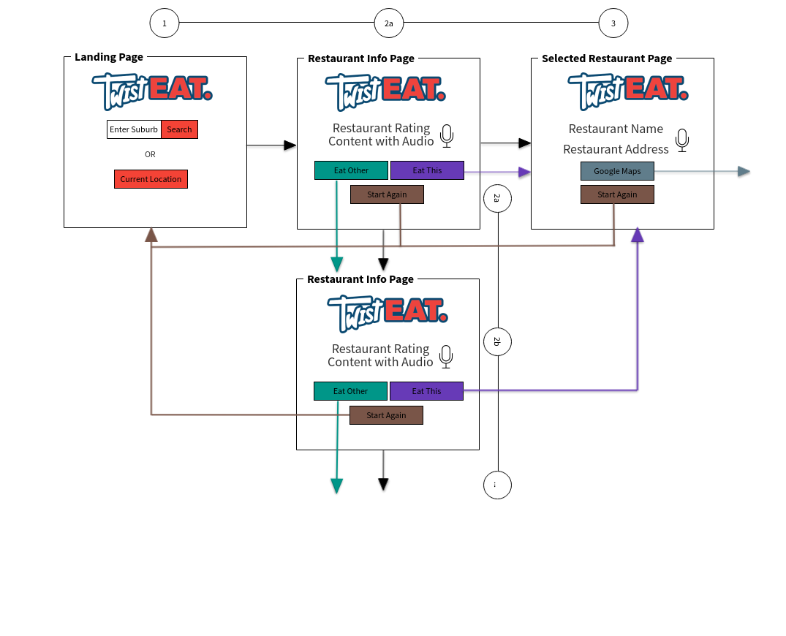

## Twist Eat

* This app uses the users input location or current location to search for restaurants in the area.

* It will then spit out one of the worst rated restaurant, and tell the user to eat there, along with a light-hearted insult.

## API used

* Google's text-speech API to read the insult to the user.

* Google's Places API for restaurant information.

* Google's Maps API to get suburb location or current location

## Wire Frame

## Presentation

https://docs.google.com/presentation/d/1qDpQ5rLg2UNgWCKKzsLox3AEiFWDqgFKgACtcj8vgDk/edit?usp=sharing

## Demo

## Live Website

https://priyam009.github.io/twist-eat/

* Enter the location where you want to find the worst restaurants or find the worst restaurant in your current location.

* App will spit out the worst restaurants in that area with a light hearted insult.

* Eat Other to look for more restaurants.

* Eat This to select the restaurant.

* Google Maps will redirect you to the resturants map location.

## Team Members

1. Priyam
2. Sam
3. Gerard